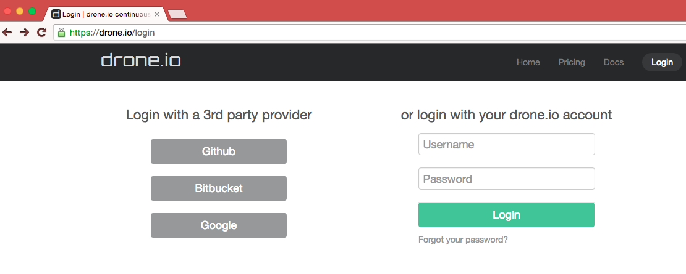
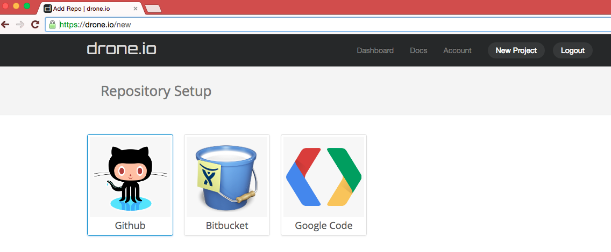
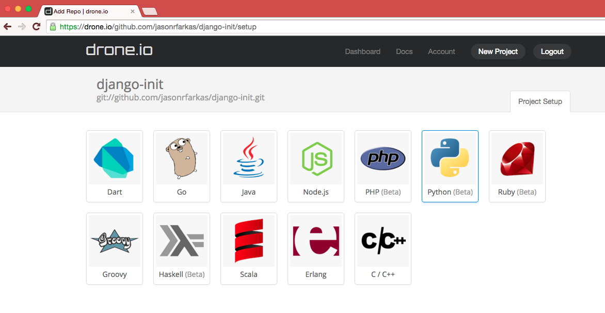
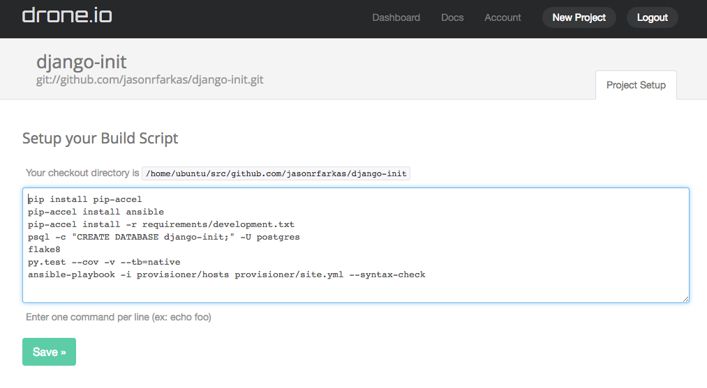
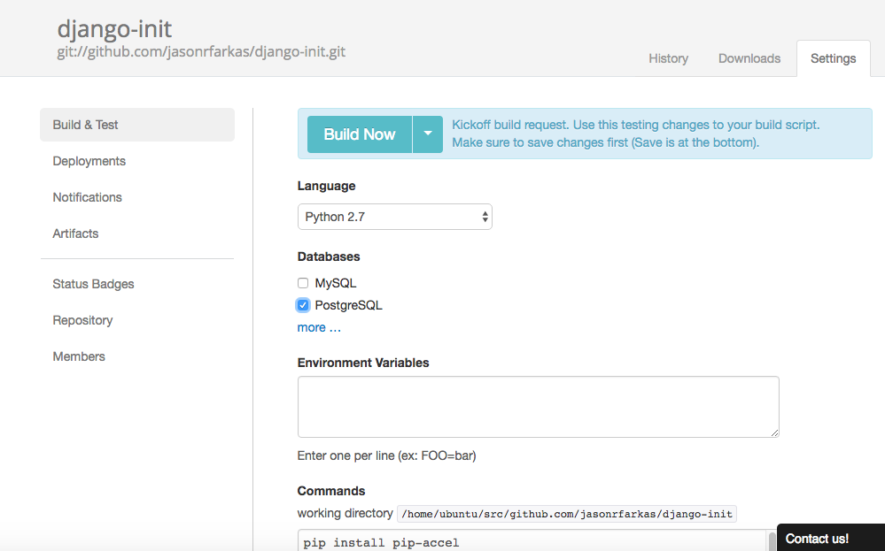
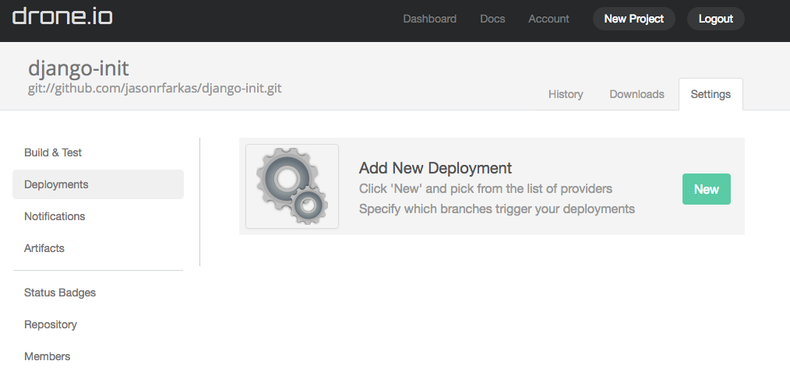
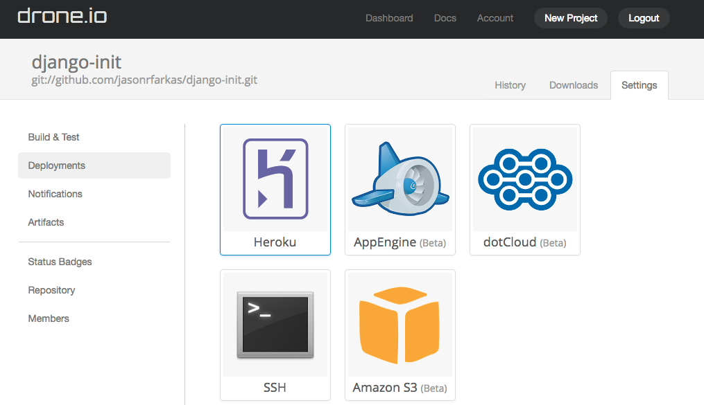
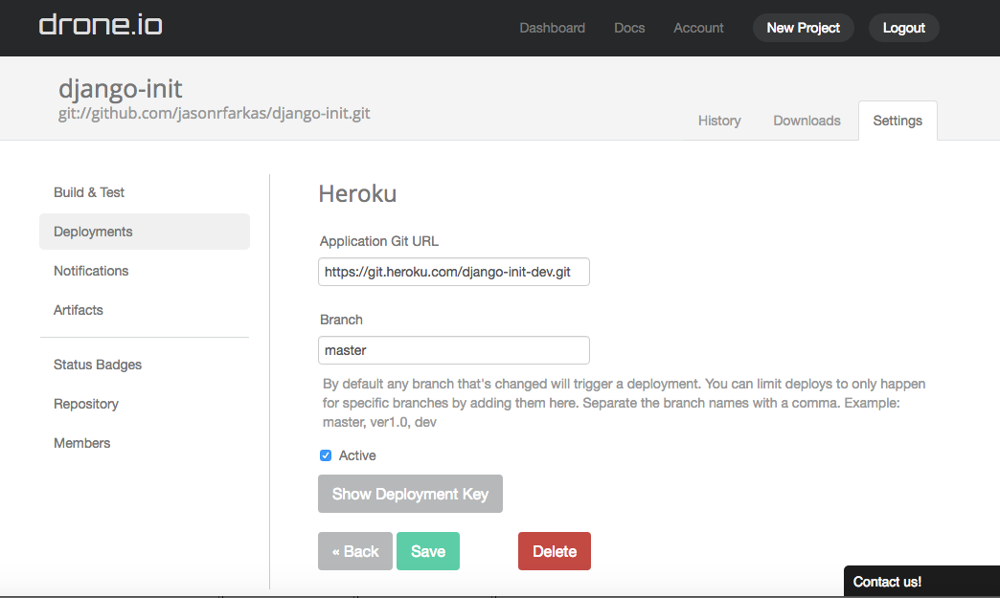

# Travis

	TODO

# Circleci

	TODO

# Drone.io and Drone

## Setting up Django Init with Drone.io Continuous Integration

Drone.io is a hosting platform that uses the open source drone software. 
To learn more about drone and setting up your personal server to run CI testing visit [github](https://github.com/drone/drone) and [thier docs/forums](http://readme.drone.io/community/overview/) [this] [http://linoxide.com/linux-how-to/setup-drone-continuous-integration-linux/] may also be helpful. 

### Instructions:
1. ###### Head to [Drone.io](https://drone.io)

2. ###### Sign up for desired plan

3- [Login](https://drone.io/login)
You can login with your hosting service account



4. ###### [Start a new project](https://drone.io/new) and select where to look for your repo


5. ###### Select ` doctest-web ` for your repo

6. ###### Setup the project by selecting python 


7. ###### Setup your Build Script by replacing the text field with the following: 
 
```
pip install pip-accel
pip-accel install ansible
pip-accel install -r requirements/development.txt

psql -c "CREATE DATABASE doctest;" -U postgres


flake8
py.test --cov -v --tb=native
ansible-playbook -i provisioner/hosts provisioner/site.yml --syntax-check
```

8. ###### Click "Save"


9. ###### Insure Python version is correct, or change as needed.

10. ###### Select PostgreSQL 


11. ###### Click "Build Now"
Your project will now be built and script will be run when drone.io recognizes acitiviy on this repo


### Set up Heroku deployment

12. ######  Click ( "Deployment" )[https://drone.io/github.com/Fueled/doctest-web/admin/deployments#/]

13. ###### Click "New"


14. ###### Click "Heroku"


15. ###### Add `https://git.heroku.com:doctest-dev.git` under the Application Git URL

16. ###### Add `master` under Branch

17. ###### Add the deployment key to Heroku account
You can do this by showing the deployment key, copying it, going to (Heroku)[https://dashboard.heroku.com/account] and adding it as a registered SSH key

18. ###### Click Save


19. ###### To have deployment for other branches including testing and production repeat steps 14 --> 18 with:
- doctest-qa for branch qa
- doctest-prod for branch prod

20. ###### To change email reception settings click on notifications


